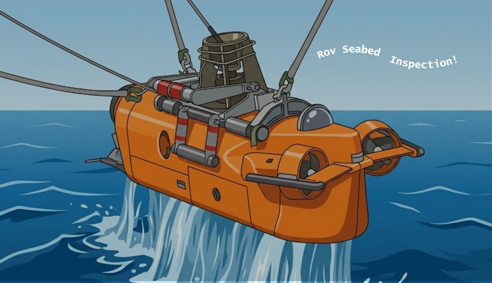
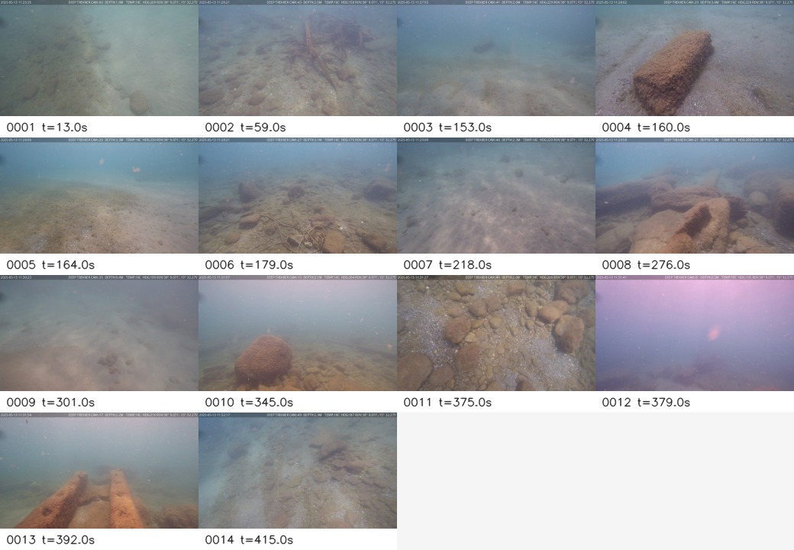
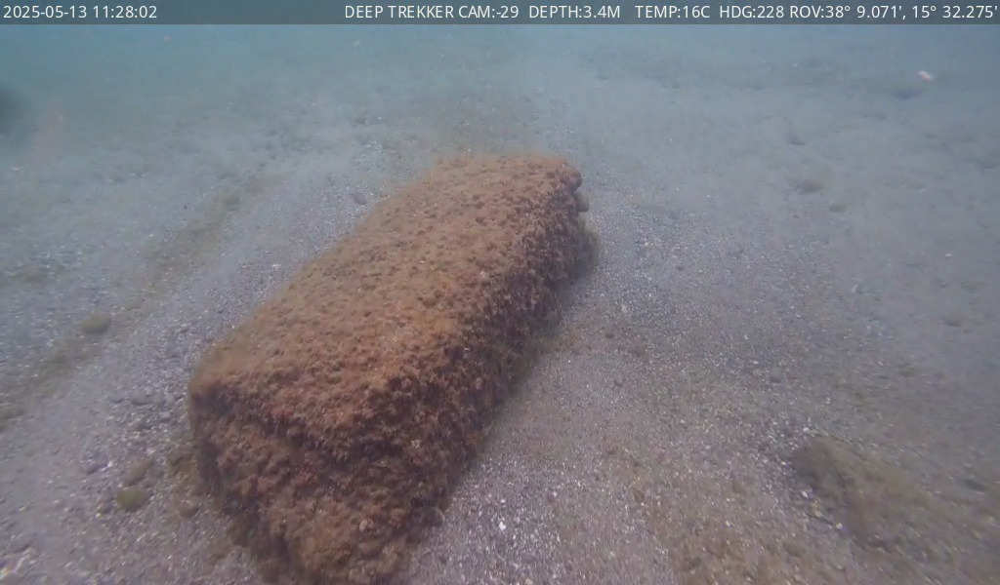
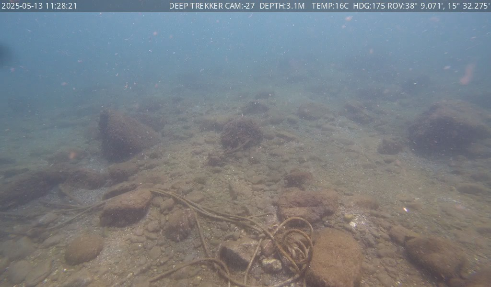

# ROV Seabed Inspection

<p align="center">
  
</p>

<p align="center">
  <em>Turn raw ROV seabed footage into a short, reviewable inspection report.</em>
</p>

<p align="center">
  
  
  
</p>

<p align="center">
  <sub>Project for the <strong>Computer Vision and Pattern Recognition</strong> MSc course at <strong>USI Lugano</strong>.</sub>
</p>

## What is this?

**ROV Seabed Inspection** is a small, script-based pipeline for reviewing underwater
ROV (Remotely Operated Vehicle) video. Instead of watching the full recording, it:

1. **Selects** a handful of visually representative frames (keyframes) from the video.
2. **Annotates** each keyframe with a local Vision-Language Model (VLM) running on your machine.
3. **Synthesizes** the per-frame annotations into a single Markdown inspection report.

Everything runs **locally on Apple Silicon** — no cloud calls, no API keys. The goal is to
be honest and conservative: ambiguous findings are flagged as *possible* rather than hidden,
so a human reviewer stays in the loop.

## How it works

The pipeline has three stages. They can be run one by one, or chained together by
`scripts/run_pipeline.py`. Each stage reads its parameters from a per-video YAML file
under `configs/` (command-line flags still work and override the YAML).

| Stage | Script | In → Out |
|------|--------|----------|
| **1. Keyframe selection** | `select_keyframes.py` | video (+ optional depth CSV) → selected JPEGs, `keyframes.csv`, `contact_sheet.jpg` |
| **2. VLM annotation** | `analyze_keyframes_vlm.py` | keyframe folder → `frame_reports.{jsonl,json,csv,md}` |
| **3. Report synthesis** | `synthesize_report.py` | `frame_reports.json` → `final_report.md` (+ representative frames, contact sheet) |

Stage 1 samples frames, applies optional depth and quality filtering, then keeps frames
that are *visually novel* using classical descriptors, **DINOv3** embeddings, or a hybrid of
both. The result is a contact sheet of everything the pipeline decided was worth looking at:

<p align="center">
  
</p>

Stage 2 sends each keyframe to a local VLM and records a structured annotation (substrate,
algae, waste, fauna, structures, and visible ROV equipment). Stage 3 groups similar adjacent
frames, keeps conservative representatives, and writes the final report.

## Installation

> **Requirements:** macOS on **Apple Silicon** (M-series) with Metal. The VLM stage uses
> `mlx-vlm`, so run it from a normal macOS terminal — headless or sandboxed sessions may not
> be able to start the local model. Tested with **Python 3.13**.

```bash
# 1. Clone
git clone https://github.com/ferdagainagainagain/rov-seabed-inspection.git
cd rov-seabed-inspection

# 2. Create and activate a virtual environment
python3 -m venv .venv
source .venv/bin/activate

# 3. Install the project and its dependencies (pinned in pyproject.toml)
pip install --upgrade pip
pip install -e .
```

`pip install -e .` installs the pinned dependencies (`mlx-vlm`, `torch`, `transformers`,
`opencv-python`, …) and makes the `rov_inspect` package importable. Activate the environment
(`source .venv/bin/activate`) in every new terminal before running the pipeline.

## Models

The pipeline uses two kinds of model. Both are downloaded from the
[Hugging Face Hub](https://huggingface.co) and cached locally (by default under
`~/.cache/huggingface`). They download automatically the first time you run a stage, but you
can also fetch them ahead of time with the steps below.

### 1. DINOv3 — keyframe novelty (Stage 1)

Used to measure how *visually different* each frame is, so the selector keeps novel views and
skips near-duplicates.

- **Model:** `facebook/dinov3-vits16-pretrain-lvd1689m`
- **Size:** small (ViT-S/16, ≈ 90 MB)
- **Access:** this is a **gated** model — you must accept Meta's license once, while logged in.

Steps:

```bash
# a. Log in to Hugging Face (create a free token at https://huggingface.co/settings/tokens)
hf auth login        # older alias: huggingface-cli login

# b. Open the model page in a browser and click "Agree and access repository":
#    https://huggingface.co/facebook/dinov3-vits16-pretrain-lvd1689m

# c. (Optional) pre-download into the local cache
hf download facebook/dinov3-vits16-pretrain-lvd1689m
```

If you skip DINOv3 you can still run Stage 1 with the classical descriptor backend
(`descriptor_backend: classical` in the YAML), which needs no model download.

### 2. Vision-Language Model — frame annotation (Stage 2)

Used to describe each keyframe and fill in the structured annotation fields. These are public
MLX-format models (no login or license acceptance needed) and run on Apple Metal via `mlx-vlm`.

| Role | Model | Approx. size |
|------|-------|--------------|
| **Default** | `mlx-community/Qwen3-VL-4B-Instruct-4bit` | ≈ 2.5 GB |
| Alternative | `mlx-community/gemma-4-e4b-it-4bit` | ≈ 2.8 GB |

```bash
# Pre-download the default model (otherwise it downloads on first run of Stage 2)
hf download mlx-community/Qwen3-VL-4B-Instruct-4bit
```

To use the alternative model, pass it on the command line or set it in the YAML:

```bash
python scripts/analyze_keyframes_vlm.py --config configs/video1.yaml \
  --model-name mlx-community/gemma-4-e4b-it-4bit
```

## Usage

Each stage reads its parameters from a per-video YAML config under `configs/`. CLI flags
override the YAML values when given.

**Run the full pipeline (Stage 1 → 2 → 3) in one command:**

```bash
python scripts/run_pipeline.py --config configs/video1.yaml
```

**Or run the stages individually:**

```bash
python scripts/select_keyframes.py      --config configs/video1.yaml
python scripts/analyze_keyframes_vlm.py --config configs/video1.yaml
python scripts/synthesize_report.py     --config configs/video1.yaml
```

A config has one section per stage (see [`configs/video1.yaml`](configs/video1.yaml)):

```yaml
keyframes:
  video: data/VIDEO 1/videos/2025-05-13_09-49-42_DEEP_TREKKER_SD.mp4
  output: outputs/keyframes_video1
  descriptor_backend: dino
  novelty_threshold: 0.3
  depth_csv: data/VIDEO 1/data/depth_log.csv
  depth_filter_mode: boundary

vlm:
  images_dir: outputs/keyframes_video1/2025-05-13_09-49-42_DEEP_TREKKER_SD
  output_dir: outputs/frame_reports/video1
  overwrite: true

synthesize:
  frame_reports: outputs/frame_reports/video1/frame_reports.json
  output_dir: outputs/final_reports/video1
  title: ROV Seabed Inspection Summary - Video 1
  copy_final_frames: true
  overwrite: true
```

Each stage produces:

```text
outputs/keyframes_video1/<video_stem>/   # Stage 1: frame_NNNN_*.jpg, keyframes.csv, contact_sheet.jpg
outputs/frame_reports/video1/            # Stage 2: frame_reports.{jsonl,json,csv,md}
outputs/final_reports/video1/            # Stage 3: final_report.md, final_keyframes.csv,
                                         #          final_frame_reports.json, final_contact_sheet.jpg,
                                         #          final_frames/  (when copy_final_frames: true)
```

To run on a new video, copy `configs/video1.yaml` to `configs/videoN.yaml` and edit the paths
inside.

## Example output (Demo: Video 7)

A complete demo run is included under [`demo/video7/`](demo/video7/), so you can see real
output without running anything. Open the generated report here:

➡️ **[`demo/video7/final_report/final_report.md`](demo/video7/final_report/final_report.md)**

Two of the representative frames the pipeline kept:

<p align="center">
  
  
</p>

<p align="center">
  <sub>Left: <em>"An anthropogenic object covered in sediment"</em> — waste flagged <code>clear</code>.
  Right: a coiled <em>ROV tether</em> — recorded as ROV equipment, not as environmental debris.</sub>
</p>

The demo includes the source-video metadata, copied keyframes, per-frame reports, and the
final synthesized report. The original video (~215 MB) is large and is not tracked by Git.

## Output schema

For each frame the VLM fills in **status** fields, the preferred way to read findings:

- `algae_status`, `waste_status`, `fauna_status`, `structure_status`

with allowed values:

- `clear` — clearly visible
- `possible` — ambiguous but worth flagging
- `none` — no visual evidence

`possible` matters for underwater footage, where visibility, lighting, turbidity, and partial
occlusion make biological and man-made content genuinely uncertain.

The pipeline also separates **visible ROV equipment** from environmental findings, so a tether
or cable is not mistaken for debris or a fixed structure:

- `rov_equipment_status`: `none`, `possible`, or `clear`
- `rov_equipment_type`: `none`, `tether`, `cable`, `robot_part`, or `other`

For backwards compatibility, boolean fields (`algae_present`, `waste_present`, …) are also
written, derived as `true` when the matching status is `possible` or `clear`.

## Evaluation (optional)

If you hand-label a video's ground truth (see `ground_truth/`), you can compare the VLM
annotations against it:

```bash
python scripts/evaluate_against_ground_truth.py --config configs/video1.yaml
# → outputs/evaluation/video1/evaluation_metrics.json, evaluation.md
```

## Limitations

- Local VLM outputs should be interpreted cautiously — a `possible` finding is **not** a certain fact.
- Underwater visibility, turbidity, lighting, and partial occlusion all affect predictions.
- The pipeline is intentionally **conservative and high-recall**: it may keep extra frames or
  flag ambiguous findings, leaving the final judgement to a human reviewer.

## Acknowledgments

- Built for the **Computer Vision and Pattern Recognition** MSc course at **USI Lugano**.
- Uses [DINOv3](https://huggingface.co/facebook/dinov3-vits16-pretrain-lvd1689m) and local
  VLMs served through [`mlx-vlm`](https://github.com/Blaizzy/mlx-vlm).
