# ROV Seabed Inspection Summary - Video 7

## Source / Navigation

- Frame reports JSON: `../../frame_reports/video7/frame_reports.json`
- Full per-frame Markdown: `../../frame_reports/video7/frame_reports.md`
- Original keyframe folder: `../../keyframes_video7/2025-05-13_11-25-23_DEEP_TREKKER_SD`
- Final frames folder: `final_frames`

## General Synthesis

14 analyzed frames were reduced to 14 representative frames.

Dominant substrate labels across analyzed frames: mixed: 12, sand: 2.

Water visibility distribution: medium: 8, poor: 6.

Rocks were observed in the analyzed frames.

Cobbles were observed in the analyzed frames.

Possible algal cover was flagged in 6 frame(s).

Clear environmental debris / anthropogenic items were marked in 2 frame(s), with possible debris in 1 frame(s).

Possible fauna was flagged in 8 frame(s).

Clear fixed man-made structures were marked in 1 frame(s), with possible structure-like material in 1 frame(s).

ROV equipment/tether was clearly visible in 1 frame(s). Types: tether: 1.

## Representative Keyframes

### frame_0001_t00013.0.jpg

- Timestamp: 13.0s
- Image path: `final_frames/final_0001_t00013.0.jpg`

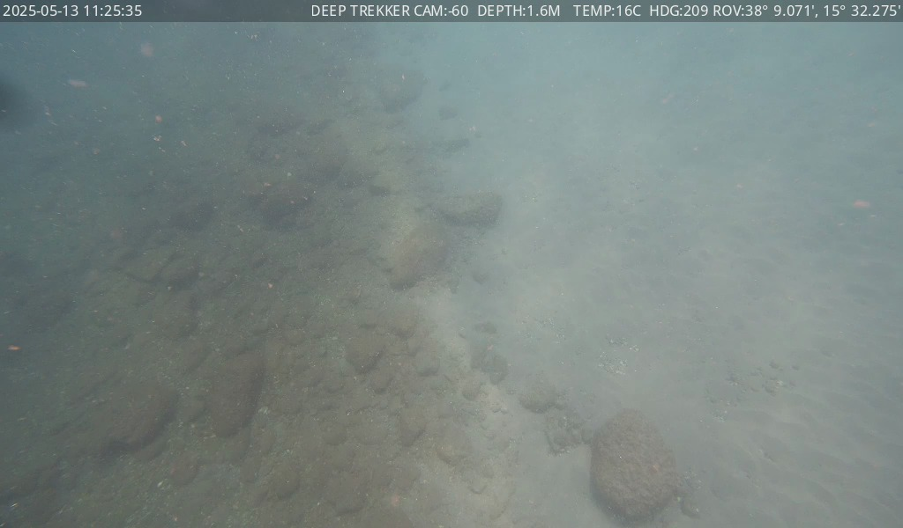

- Short description: Underwater seabed with scattered rocks and cobbles in murky water.
- Substrate: mixed
- Rocks present: True
- Cobbles present: True
- Algae status: none
- Waste status: none
- Fauna status: none
- Structure status: none
- ROV equipment status: none
- ROV equipment type: none
- Water visibility: poor
- Inspection importance: medium
- Uncertainty: medium
- Keep reason: first_frame

### frame_0002_t00059.0.jpg

- Timestamp: 59.0s
- Image path: `final_frames/final_0002_t00059.0.jpg`

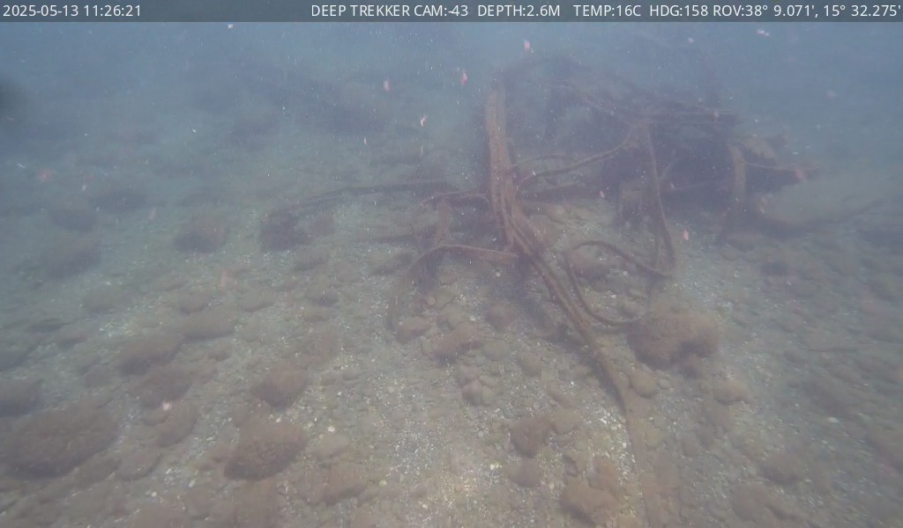

- Short description: The seabed contains scattered rocks and cobbles with some algae-covered surfaces and visible waste-like objects, while small fish-like forms are present in the water column.
- Substrate: mixed
- Rocks present: True
- Cobbles present: True
- Algae status: possible
- Waste status: possible
- Fauna status: possible
- Structure status: possible
- ROV equipment status: none
- ROV equipment type: none
- Water visibility: medium
- Inspection importance: medium
- Uncertainty: medium
- Keep reason: important_status

### frame_0003_t00153.0.jpg

- Timestamp: 153.0s
- Image path: `final_frames/final_0003_t00153.0.jpg`

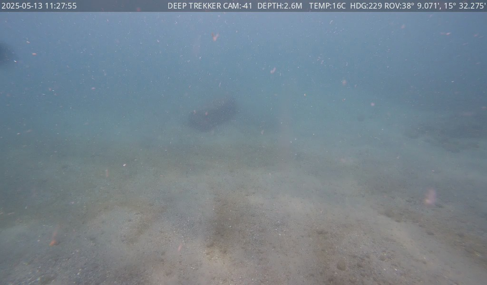

- Short description: The seabed is sandy with scattered small particles and a faintly visible dark object in the mid-water.
- Substrate: sand
- Rocks present: False
- Cobbles present: False
- Algae status: none
- Waste status: none
- Fauna status: possible
- Structure status: none
- ROV equipment status: none
- ROV equipment type: none
- Water visibility: poor
- Inspection importance: medium
- Uncertainty: medium
- Keep reason: important_status

### frame_0004_t00160.0.jpg

- Timestamp: 160.0s
- Image path: `final_frames/final_0004_t00160.0.jpg`

- Short description: An anthropogenic object covered in sediment rests on a mixed seabed.
- Substrate: mixed
- Rocks present: False
- Cobbles present: False
- Algae status: possible
- Waste status: clear
- Fauna status: none
- Structure status: none
- ROV equipment status: none
- ROV equipment type: none
- Water visibility: medium
- Inspection importance: medium
- Uncertainty: medium
- Keep reason: important_status

### frame_0005_t00164.0.jpg

- Timestamp: 164.0s
- Image path: `final_frames/final_0005_t00164.0.jpg`

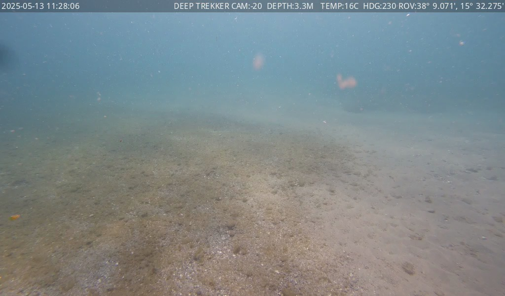

- Short description: A sandy seabed with scattered small particles and faint suspended matter, with moderate visibility.
- Substrate: sand
- Rocks present: False
- Cobbles present: False
- Algae status: none
- Waste status: none
- Fauna status: none
- Structure status: none
- ROV equipment status: none
- ROV equipment type: none
- Water visibility: medium
- Inspection importance: medium
- Uncertainty: medium
- Keep reason: semantic_change

### frame_0006_t00179.0.jpg

- Timestamp: 179.0s
- Image path: `final_frames/final_0006_t00179.0.jpg`

- Short description: An underwater seabed with rocks, cobbles, and a coiled tether, with some particles floating in the water.
- Substrate: mixed
- Rocks present: True
- Cobbles present: True
- Algae status: possible
- Waste status: clear
- Fauna status: possible
- Structure status: none
- ROV equipment status: clear
- ROV equipment type: tether
- Water visibility: medium
- Inspection importance: medium
- Uncertainty: medium
- Keep reason: rov_equipment_visible

### frame_0007_t00218.0.jpg

- Timestamp: 218.0s
- Image path: `final_frames/final_0007_t00218.0.jpg`

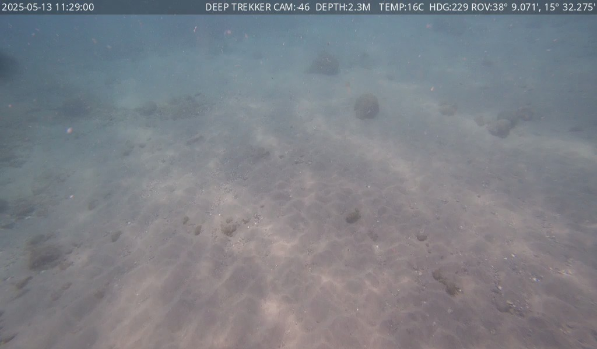

- Short description: The seabed is sandy with scattered rocks and cobbles, and faint movement suggests possible small fauna.
- Substrate: mixed
- Rocks present: True
- Cobbles present: True
- Algae status: none
- Waste status: none
- Fauna status: possible
- Structure status: none
- ROV equipment status: none
- ROV equipment type: none
- Water visibility: medium
- Inspection importance: medium
- Uncertainty: medium
- Keep reason: important_status

### frame_0008_t00276.0.jpg

- Timestamp: 276.0s
- Image path: `final_frames/final_0008_t00276.0.jpg`

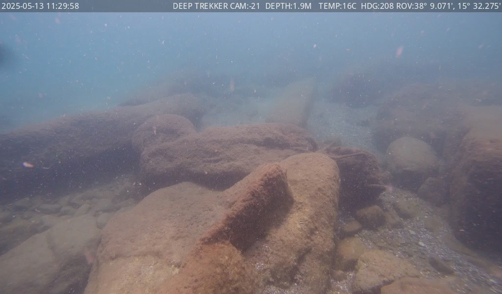

- Short description: Underwater view of a rocky seabed with scattered small particles and faint movement, indicating low visibility.
- Substrate: mixed
- Rocks present: True
- Cobbles present: True
- Algae status: possible
- Waste status: none
- Fauna status: possible
- Structure status: none
- ROV equipment status: none
- ROV equipment type: none
- Water visibility: medium
- Inspection importance: medium
- Uncertainty: medium
- Keep reason: important_status

### frame_0009_t00301.0.jpg

- Timestamp: 301.0s
- Image path: `final_frames/final_0009_t00301.0.jpg`

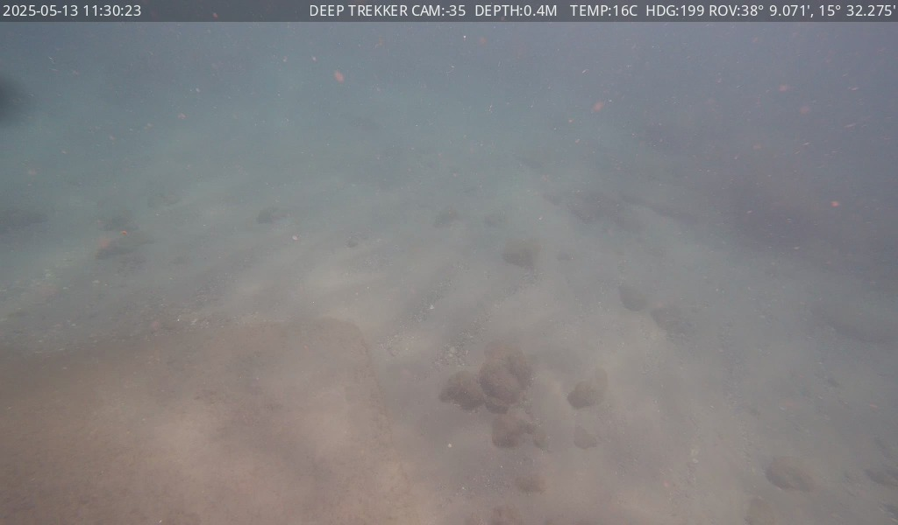

- Short description: Underwater seabed with scattered rocks and cobbles in murky water.
- Substrate: mixed
- Rocks present: True
- Cobbles present: True
- Algae status: none
- Waste status: none
- Fauna status: none
- Structure status: none
- ROV equipment status: none
- ROV equipment type: none
- Water visibility: poor
- Inspection importance: medium
- Uncertainty: medium
- Keep reason: semantic_change

### frame_0010_t00345.0.jpg

- Timestamp: 345.0s
- Image path: `final_frames/final_0010_t00345.0.jpg`

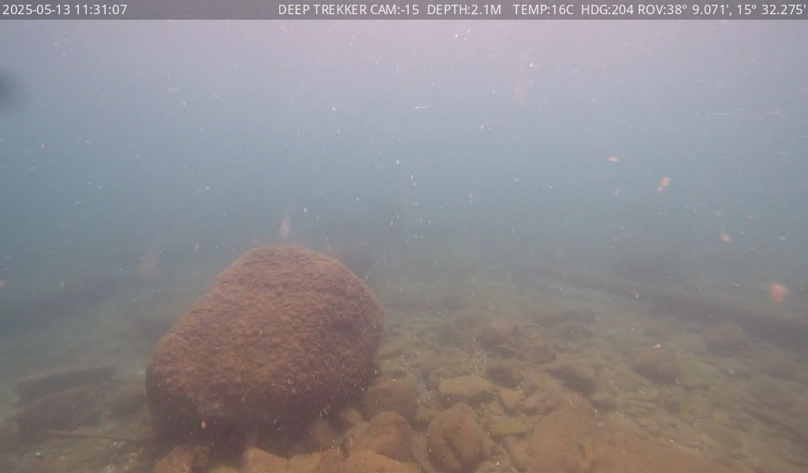

- Short description: An underwater view of a rocky seabed with a large boulder and scattered smaller rocks, with poor visibility and faint motion in the water.
- Substrate: mixed
- Rocks present: True
- Cobbles present: True
- Algae status: possible
- Waste status: none
- Fauna status: possible
- Structure status: none
- ROV equipment status: none
- ROV equipment type: none
- Water visibility: poor
- Inspection importance: medium
- Uncertainty: medium
- Keep reason: important_status

### frame_0011_t00375.0.jpg

- Timestamp: 375.0s
- Image path: `final_frames/final_0011_t00375.0.jpg`

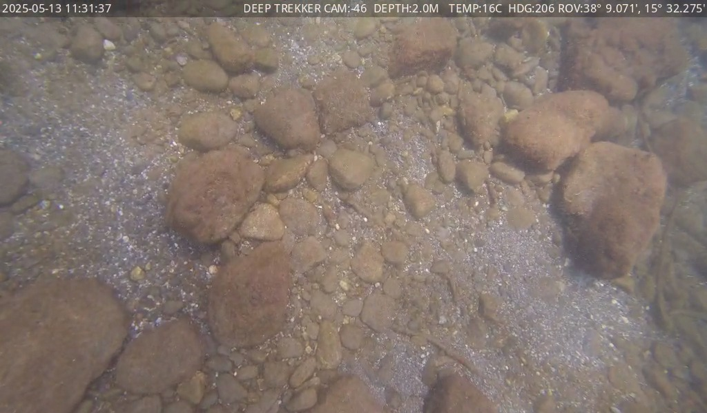

- Short description: Underwater view of a rocky seabed with mixed sediment and stones, with no visible algae, waste, or fauna.
- Substrate: mixed
- Rocks present: True
- Cobbles present: True
- Algae status: none
- Waste status: none
- Fauna status: none
- Structure status: none
- ROV equipment status: none
- ROV equipment type: none
- Water visibility: medium
- Inspection importance: medium
- Uncertainty: low
- Keep reason: semantic_change

### frame_0012_t00379.0.jpg

- Timestamp: 379.0s
- Image path: `final_frames/final_0012_t00379.0.jpg`

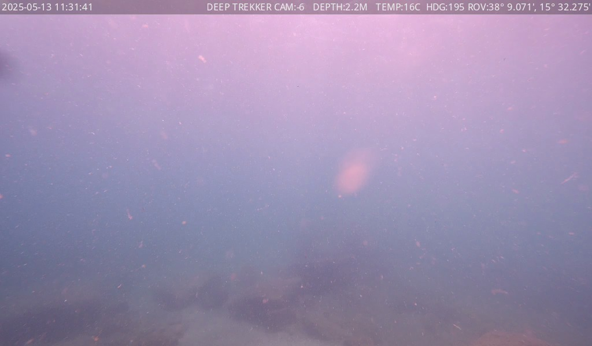

- Short description: The seabed is covered in sediment and rocks with poor visibility, and a faint, ambiguous object is visible in the water column.
- Substrate: mixed
- Rocks present: True
- Cobbles present: True
- Algae status: none
- Waste status: none
- Fauna status: possible
- Structure status: none
- ROV equipment status: none
- ROV equipment type: none
- Water visibility: poor
- Inspection importance: medium
- Uncertainty: high
- Keep reason: important_status

### frame_0013_t00392.0.jpg

- Timestamp: 392.0s
- Image path: `final_frames/final_0013_t00392.0.jpg`

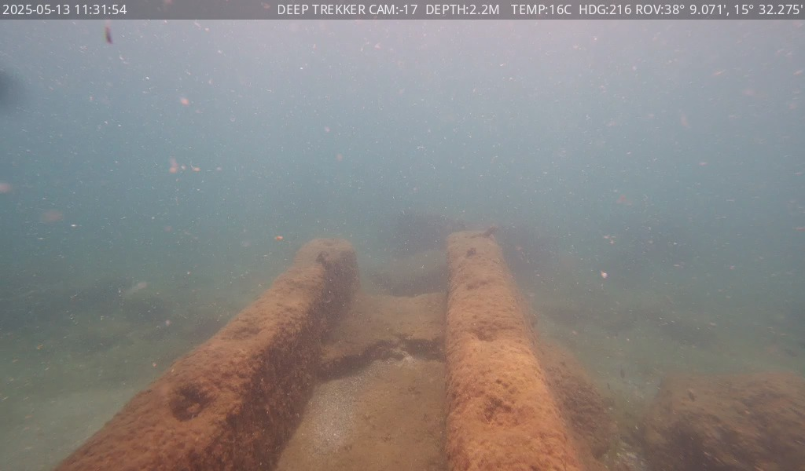

- Short description: Two large, rusted, cylindrical structures lie on a sandy and rocky seabed with poor visibility and scattered particles.
- Substrate: mixed
- Rocks present: True
- Cobbles present: True
- Algae status: possible
- Waste status: none
- Fauna status: possible
- Structure status: clear
- ROV equipment status: none
- ROV equipment type: none
- Water visibility: poor
- Inspection importance: high
- Uncertainty: medium
- Keep reason: important_status

### frame_0014_t00415.0.jpg

- Timestamp: 415.0s
- Image path: `final_frames/final_0014_t00415.0.jpg`

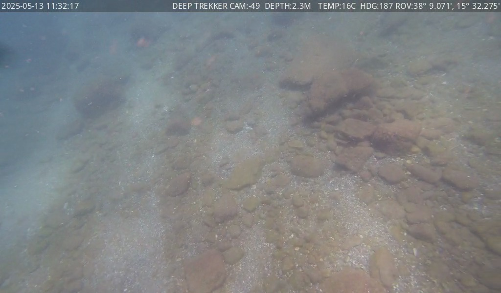

- Short description: Underwater seabed with mixed sediment and rocks, moderate visibility, no obvious waste or structures.
- Substrate: mixed
- Rocks present: True
- Cobbles present: True
- Algae status: none
- Waste status: none
- Fauna status: none
- Structure status: none
- ROV equipment status: none
- ROV equipment type: none
- Water visibility: medium
- Inspection importance: medium
- Uncertainty: medium
- Keep reason: semantic_change

## Full Analysis Reference

The complete per-frame analysis is available in: `../../frame_reports/video7/frame_reports.json`
